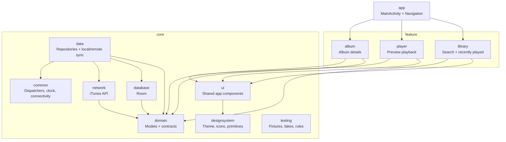

# Stemflow

Stemflow is an Android app test built for Moises.ai with Kotlin and Jetpack
Compose. It searches the iTunes API, shows track results, plays previews, keeps
a small recently played list, and lets users open the album for a track.

## Tech

- Kotlin
- Jetpack Compose + Material 3
- Navigation 3
- Hilt
- Room
- Retrofit + kotlinx.serialization
- Paging 3
- Media3
- Coil
- JUnit, Turbine, Room tests, Paging tests

## Project Layout



```text
app/                 App shell, root navigation, app-level state
feature/*            Screen-level UI and ViewModels
core/domain/         Domain models and repository interfaces
core/data/           Repository implementations
core/network/        Retrofit service and iTunes DTO mapping
core/database/       Room entities, DAOs, and database setup
core/designsystem/   Theme, icons, and shared visual primitives
core/ui/             Reusable components used by multiple features
core/common/         Dispatchers, connectivity, clock, shared utilities
core/testing/        Test fixtures, fake data sources, coroutine rules
```

## Running

Open the project in Android Studio and run the `app` configuration, or use:

```bash
./gradlew :app:installDebug
```

The app uses the public iTunes Search API, so search and album loading need a
network connection. Recently played tracks are stored locally with Room.

## Tests

Run the JVM unit tests:

```bash
./gradlew testDebugUnitTest
```

Compile the Android test sources:

```bash
./gradlew :core:data:compileDebugAndroidTestKotlin
```

There are instrumentation tests for the Room DAOs and album repository. Run them
from Android Studio or with a connected device/emulator:

```bash
./gradlew connectedDebugAndroidTest
```

## Notes

The iTunes Search API does not page like a typical offset-based API. The search
paging source works around that by requesting a larger result limit and emitting
only the new items it has not seen yet.

Album loading is cache-first: if an album is already stored locally, it is shown
immediately while a refresh runs. If there is no cached album and the refresh
fails, the album screen shows an error with retry.
